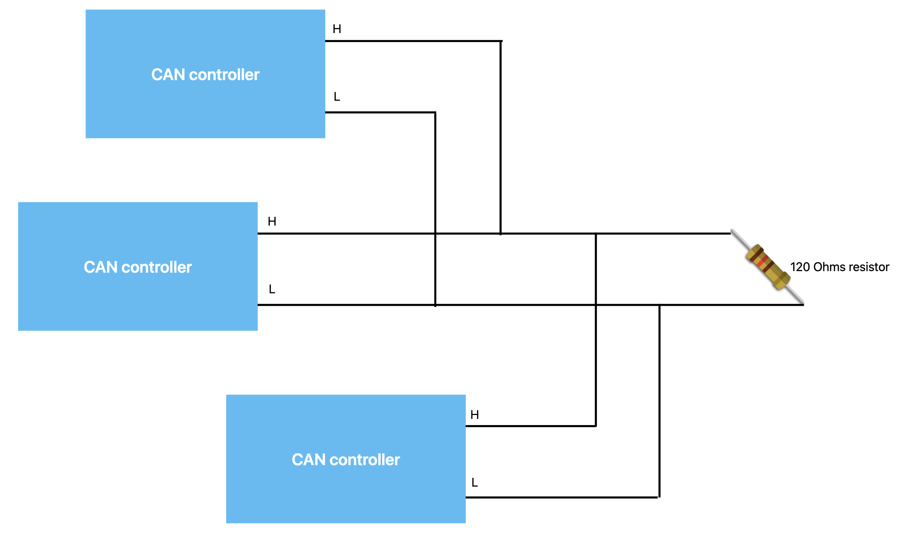
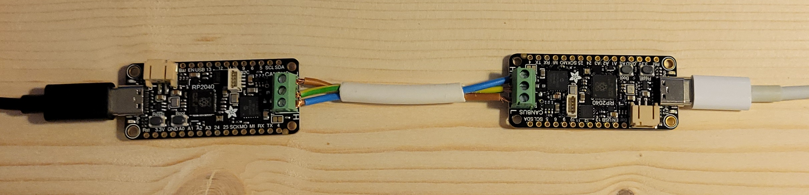

> [!CAUTION]
> I am not a microtechnician. I have basic understanding of current, resistance, tension and electromagnetism, but under no circumstance should this repo be considered a reference in any way. It is just a way to document and share the usage I make of these devices and CAN protocol, as very little similar documentation seems to be available. Use at your own risks (and pleasure, I hope ;) )
# CANBus_2040

The aim of this repo is to lay out the basics of CAN protocol, and make some basic communications using this protocol.

[Controller Area Network (CAN)](https://en.wikipedia.org/wiki/CAN_bus) is a communication standard that allows communiation between multiple devices over a shared network. The messages published on the network by the devices start with an ID so the device that is supposed to recieve the data can take the message, and the other devices on the network can ignore it.

The network architecture is as follows: 

 

And my current test setup consists of two [Adafruits rp2040 CAN bus feather microcontrollers](https://learn.adafruit.com/adafruit-rp2040-can-bus-feather) (each microcontroller has a 120 Ohms resistor inside, so no additionnal resistor is needed in this configuration):

 

## Setup

Check out the [Setup page](./Setup.md) for detailed setup information