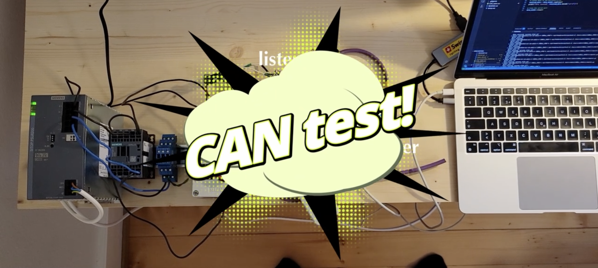

# CANBus_2040

The aim of this repo is to lay out the basics of CAN protocol, and make some basic communications using this protocol.

[Controller Area Network (CAN)](https://en.wikipedia.org/wiki/CAN_bus) is a communication standard that allows communiation between multiple devices over a shared network, using differential. The messages published on the network by the devices all start with an ID telling what's in the message, so the device that is supposed to recieve the data can take the message, and the other devices on the network can ignore it. The ID also serves to prioritize some data over another (if 2 messages with ID 0 and ID 1 are "colliding" over the network, the one with ID 0 will get priority and the other with ID 1 will wait its turn.)

The network architecture is called multi-master bus, and looks as follows: 

 

And my current test setup consists of two [Adafruits rp2040 CAN bus feather microcontrollers](https://learn.adafruit.com/adafruit-rp2040-can-bus-feather) (each microcontroller has a 120 Ohms resistor inside, so no additionnal resistor is needed in this configuration):

<!-- https://github.com/user-attachments/assets/e95860ec-5896-4961-8d06-f1ba2de9d57b -->

## Demo video:

## Setup

Check out the [Setup page](./Setup.md) for detailed setup information
