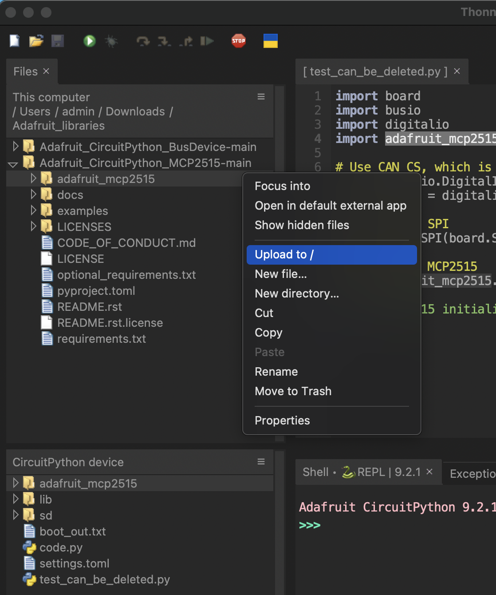

# Setup

Adafruit [provides a library](https://github.com/adafruit/Adafruit_CircuitPython_MCP2515) for the CAN controller. Here are the instruction to install it, as well as upload the code of this repo on the two microcontrollers. This repo uses as example the activation of a relay on the `listener` side by sending a command via USB to the `publisher`: 

1) Setup the Microcontroller, for example using [Thonny](https://thonny.org/):
* press and hold the *Boot* button while plugging the usb-c cable to your computer with Thonny installed.
* in the botton right corner of the Thonny IDE, click on "Local Python 3" and select "configure interpreter"
* Choose "CircuitPython" as interpreter, and the "RP2040 CAN" as Port. Circuit python will be installed if it is not already. (Note: I believe MicroPython can also be used, basic code using the MCP2515 works, but further validation is needed)
* You are good to go !

2) Install the `adafruit_mcp2515` library:
* Download the [repository](https://github.com/adafruit/Adafruit_CircuitPython_MCP2515).
* Using thonny, move the `adafruit_mcp2515` folder to the microcontroller:
<p align="center"> 

3) Upload the appropriate code and the `microcontroller_module.py`
* As ou did for the adafruit_mcp2515 library, upload the `microcontroller_module.py` in the root folder of the microcontroller
* Create a "code.py" file (*this exact file name*, so it is run automatically when powering the device on) and copy-paste the code from the appropriate file of this repo (the code of the `listener.py` if the microcontroller you connected is destined to be the listener, or `publisher.py` conversly)

4) Test the setup
With the `publisher` microcontroller connected to your computer and the `listener` microcontroller connected via CAN to the `publisher`, run the `mater.py` code. You will probably need to adapt the port. In my case it is :
```python
data_sender = serial.Serial(port='/dev/cu.usbmodem103', baudrate=115200, timeout=1)
```
One way to determine the port to use is to check the port in the Thonny IDE:
<p align="center"> 

with 101 being used for communicating with the Thonny IDE, we can select 103 for the `master` script. on Linux and mac, you can also use the terminal by typing:
```bash
ls /dev/cu.*
```